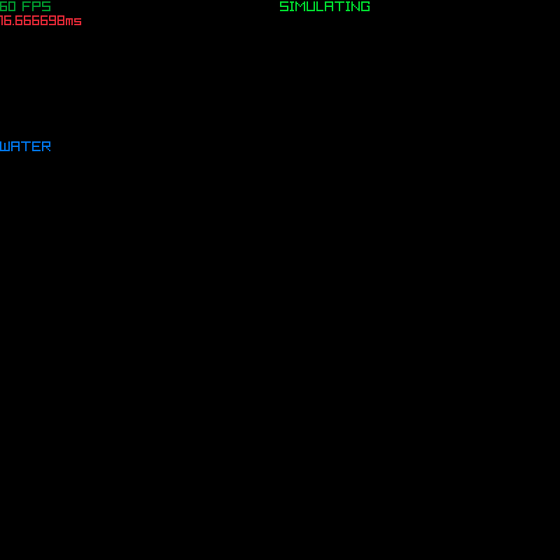

# fluidcim

<b>Instruções para buildar</b>

Instalar <a href="https://github.com/raysan5/raylib/wiki/Working-on-GNU-Linux#building-library">dependências</a> do Raylib

<ul>
    <li><b>Linux</b>: executar 'build-linux.sh'</li>
    <li><b>Windows</b>: modificar 'build-windows.bat' para o caminho correto do 'vcvarsall.bat' (precisa do Visual Studio) e executar o script</li>
</ul>
Exemplo
 
